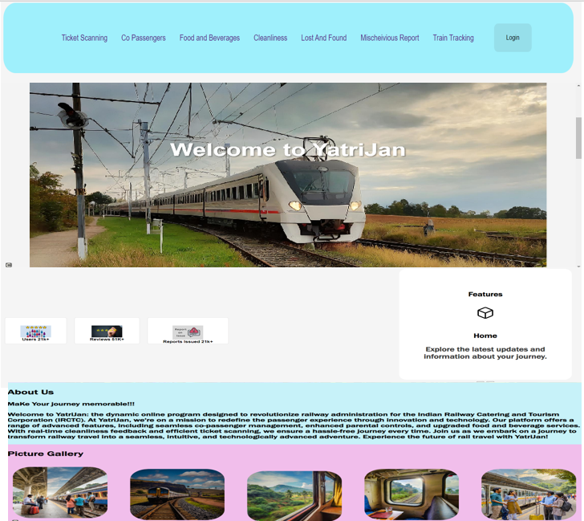
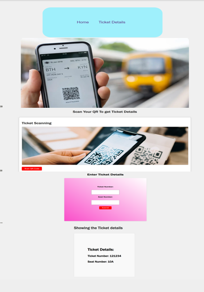
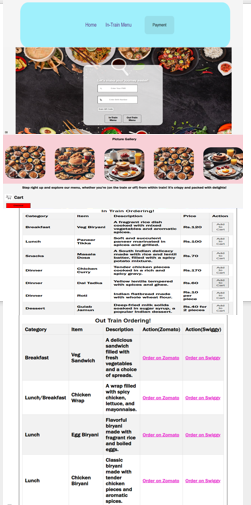
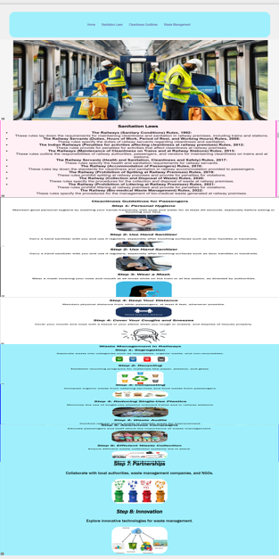
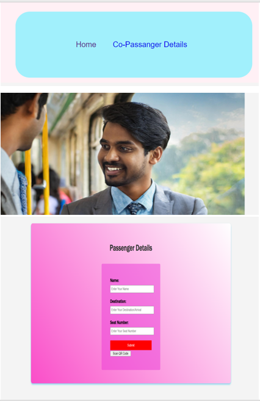

# YatriJan

## Overview
YatriJan is a dynamic online program designed to revolutionize the railway administration system for the Indian Railway Catering and Tourism Corporation (IRCTC). Our mission is to redefine the passenger experience through innovation and technology, ensuring a seamless and enjoyable railway journey for all users.

## Features
- **User Management**: Manage co-passenger details easily for a hassle-free experience.
- **Ticket Scanning**: Scan tickets for quick access to train journeys.
- **Food and Beverages**: Explore and order from a wide range of food and beverage options.
- **Cleanliness Reporting**: Report and track cleanliness issues to maintain a pleasant environment.
- **Train Tracking**: Keep track of train schedules and updates in real-time.
- **Lost and Found**: A system to report and find lost items during train journeys.

## Screenshots
Here are some screenshots of the YatriJan application:

| Feature                      | Screenshot                                       |
|------------------------------|-------------------------------------------------|
| Home Page                    |         | |
| Ticket Scanning              |  |
| Food and Beverages           |  |
| Cleanliness Reporting        |  |
| Train Tracking/Scanning      |  |
| Co-Passenger                 |  |

> **Note**: Ensure that the screenshots are saved in the `screenshots` folder within your project directory.

## Technologies Used
- HTML
- CSS
- JavaScript
- SVG Icons
- Responsive Design

## Installation
To get started with YatriJan, clone the repository and open the `index.html` file in your web browser:

```bash
git clone https://github.com/yourusername/yatrijan.git
cd yatrijan
